# Instructions (I am using a macbook)

## Set up the development environment

### Set up a virtual environment

mkdir Course_Platform
cd Course_Platform
python3 -m venv venv
source venv/bin/activate

### Install required packages

pip3 install fastapi uvicorn sqlalchemy pymysql

### Create the Project Structure

Course_Platform/
main.py
models.py
schemas.py
crud.py
database.py
requirements.txt

### Add Dependencies to requirements.txt

pip3 freeze > requirements.txt

### Verify the Setup

pip3 list

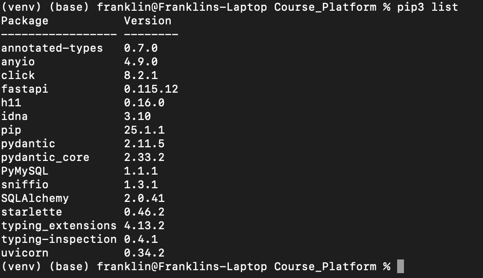

## Test the FastAPI Setup

### Basic configuration

Open main.py and add a basic FastAPI app to test

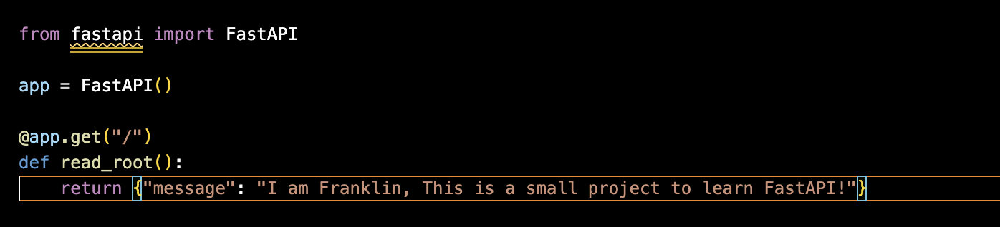

## Run the FastAPI server

uvicorn main:app --reload

Go to http://127.0.0.1:8000/  You should see the message

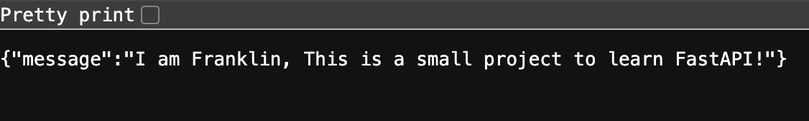

## Database Setup

### Connection to the Databse

I am using MySQL workbench, I Created a new database a tested the connectivity

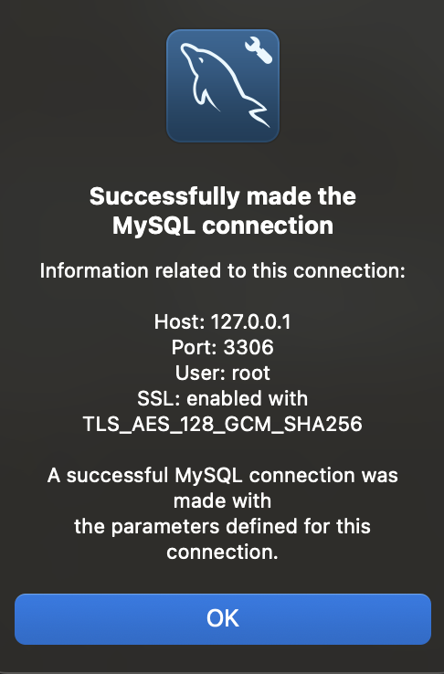

### Tables

courses

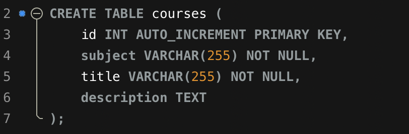

users

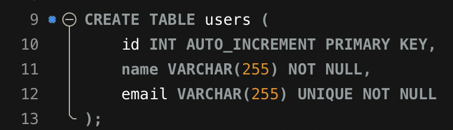

user_courses entity relationship

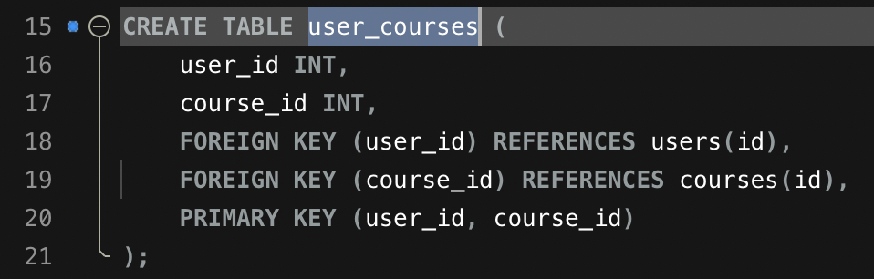

## Set Up Database Connection in FastAPI

### Basic Connfiguration

Open database.py and add the script

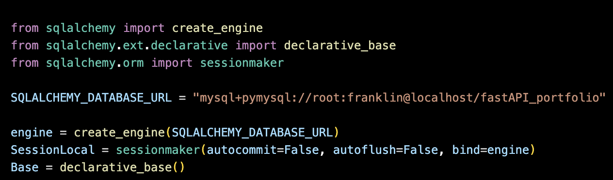

### Test the connection

Open main.py and add the script

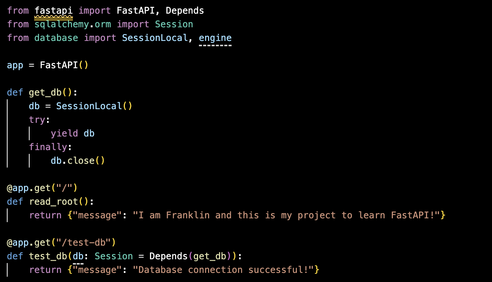

## Run the FastAPI server

uvicorn main:app --reload

go to http://127.0.0.1:8000/test-db.  You should see the message

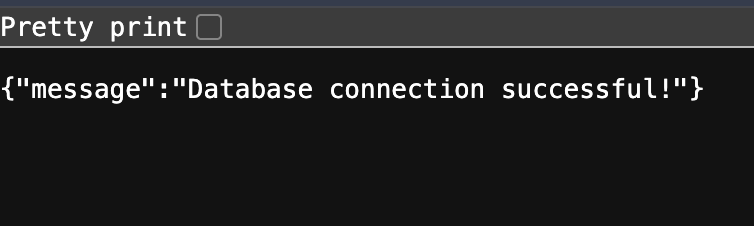

## FastAPI Models and Schemas

### Define SQLAlchemy Models

Open models.py and define the models

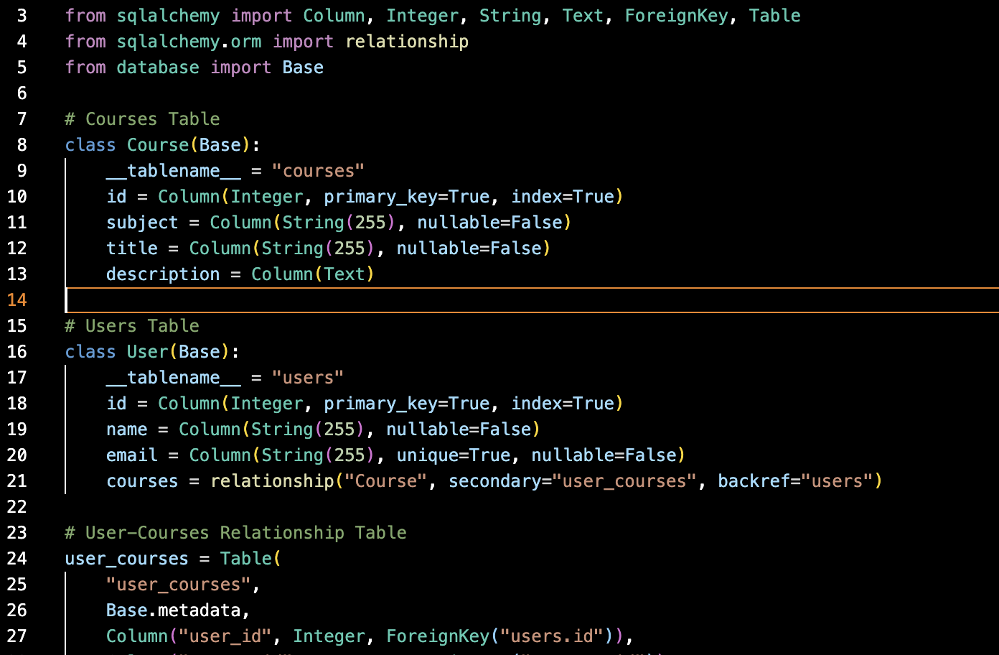

### Define Pydantic Schemas

Open schemas.py and define the schemas for data validation.

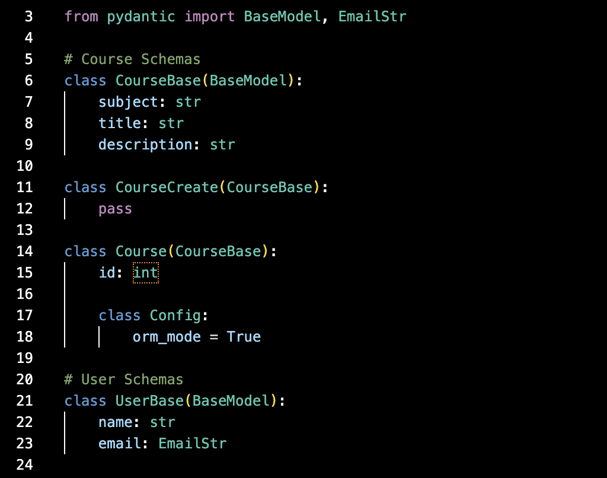

### Update database.py to Create Tables

Ensure database.py includes the code to create the tables automatically when the application starts.

### Call create_tables() in main.py

Add the create_tables() function to main.py to ensure the tables are created when the application starts.

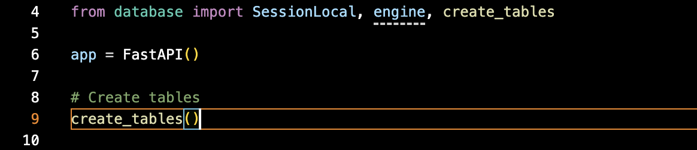

then, Verify the tables are created in MySQL Workbench.

## CRUD Operations

### CRUD Functions for Courses

Open crud.py and define the CRUD functions for the courses table.

### CRUD Functions for Users

Add the CRUD functions for the users table in crud.py.

### CRUD Functions for User-Courses Relationship

Add the functions to link users to courses in crud.py

### Update main.py to Add CRUD Endpoints

Open main.py and add the FastAPI endpoints to expose the CRUD operations.

## Run the FastAPI server

uvicorn main:app --reload

go to http://127.0.0.1:8000/docs.  You should see the Swagger UI with all the CRUD endpoints listed

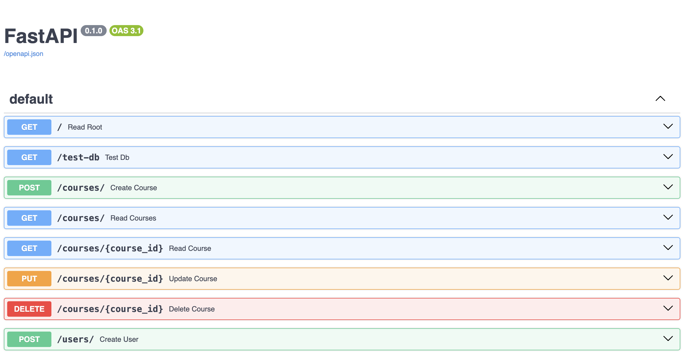

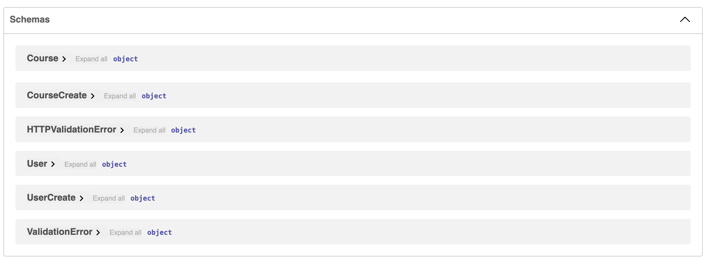

## Test the Endpoints

### Create a course and a user

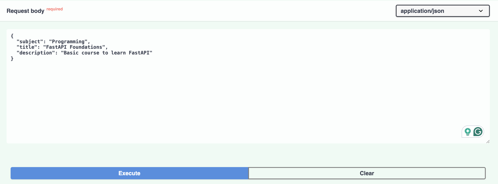

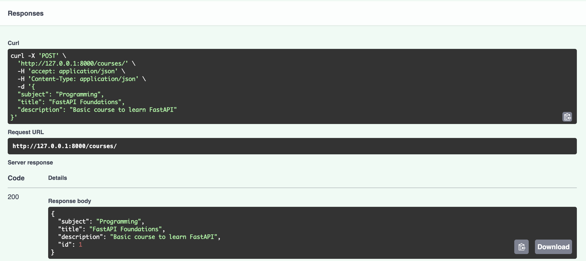

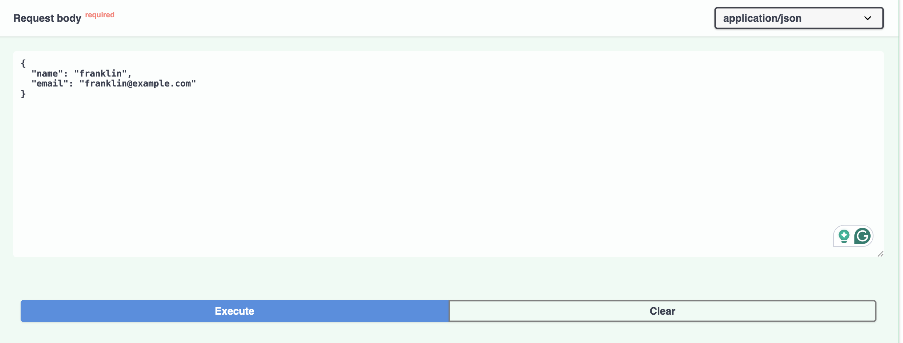

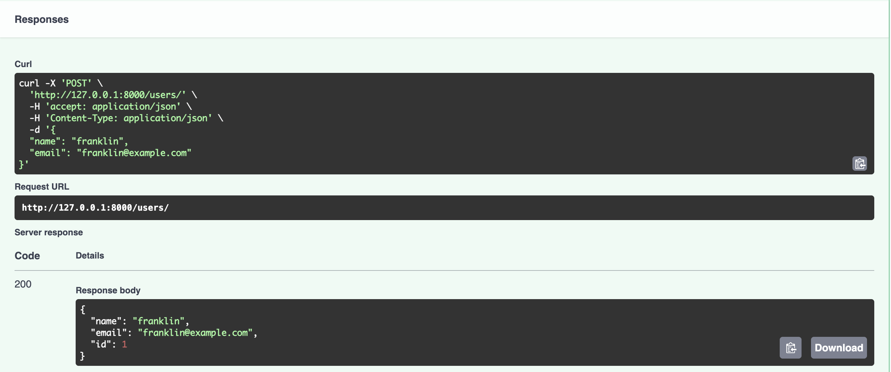

### Add a course to a user.

Please do it by yourself 

### Retrieve all courses for a user.

Please do it by yourself 

### Update and delete records.

Please do it by yourself 

