# Instructions (I am using a macbook)

## Set up the development environment

### Set up a virtual environment

mkdir Course_Platform
cd Course_Platform
python3 -m venv venv
source venv/bin/activate

### Install required packages

pip3 install Flask mysql-connector-python
pip3 install mysql-connector-python
pip3 list

### Create a requirements.txt file

Flask
mysql-connector-python

## Testing the environment

## Creating & Running a test file. 

Created the app.py file in your project directory to return  return "Hello, Course Portfolio!"

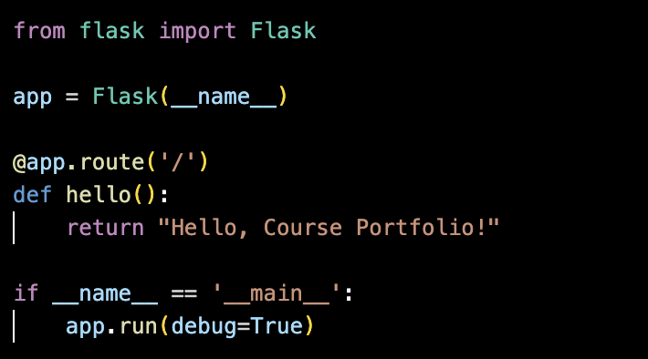

Running the file 

python3 app.py

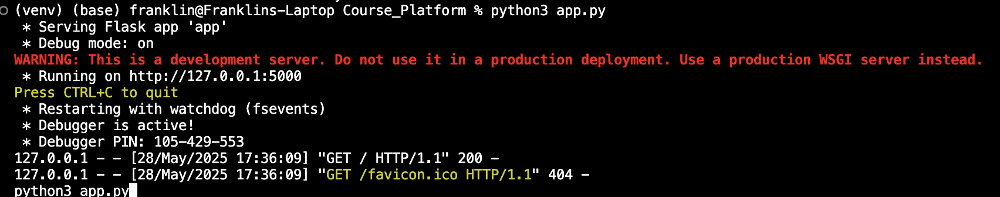

Running on http://127.0.0.1:5000

## Set up MysQL Database

### MySQL Workbench

I created a new scheme named course_portfolio

### Design the Database Schema

create two tables in your database: one for courses and one for users.

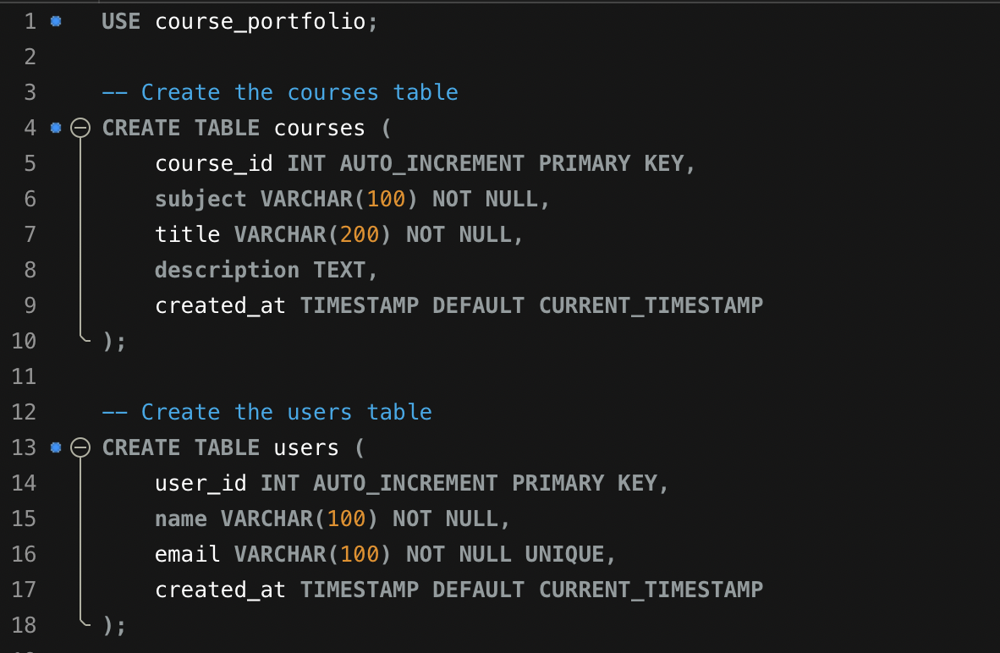

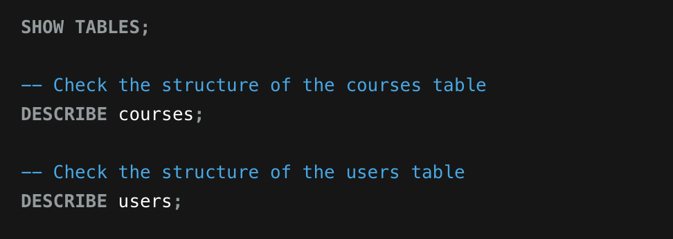

### Connecting the app to the Database

update the app.py file to connect to the MySQL database.

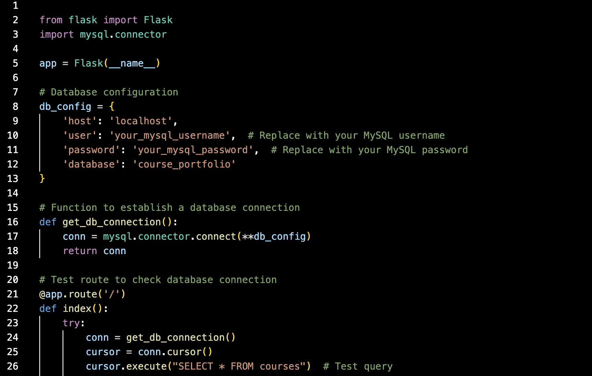

If the database connection is successful, you’ll see a message like

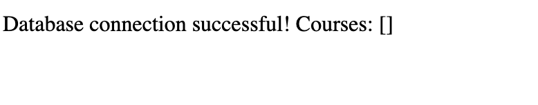

## Create API Endpoints for CRUD Operations

### Create Flask routes to handle CRUD operations

Update your app.py file

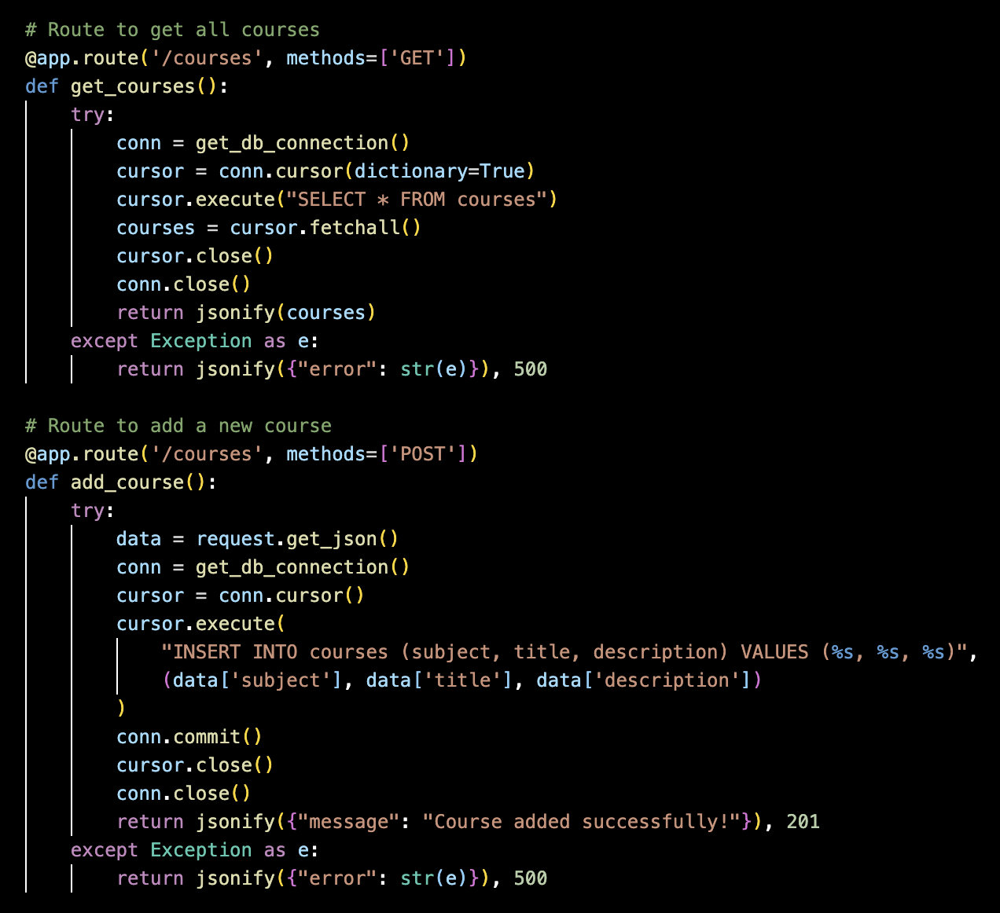

### Test the app

python3 app.py

http://127.0.0.1:5000/. You should see the message

## Test API Endpoints

### Add a New Course (POST)

Use a tool like Postman

URL: http://127.0.0.1:5000/courses
Method: POST
Body (raw): 

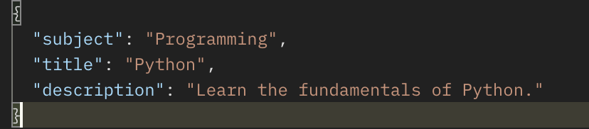

Response:

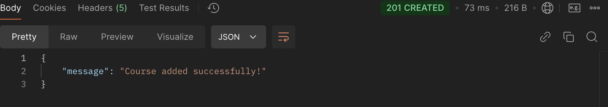

### Get All Courses (GET)

URL: http://127.0.0.1:5000/courses
Method: GET

Response:

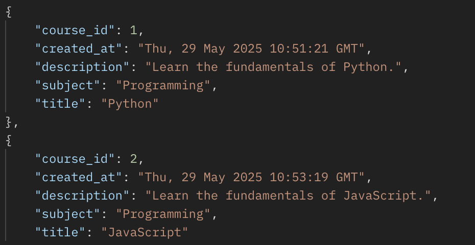

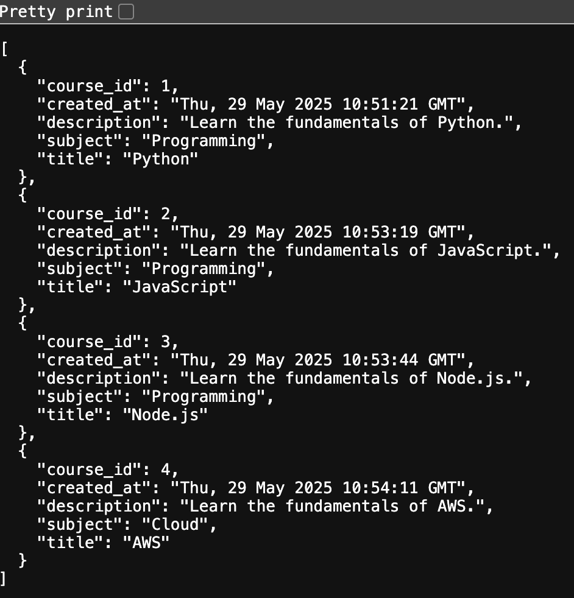

### Update a Course (PUT)

URL: http://127.0.0.1:5000/courses/4  (I choose the course_id 4)
Method: PUT
Body (raw):

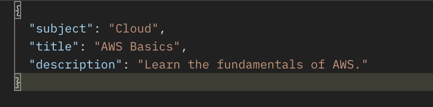

Response:

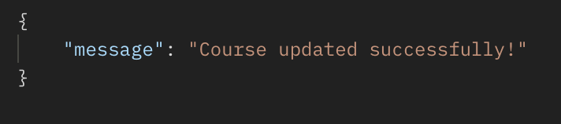

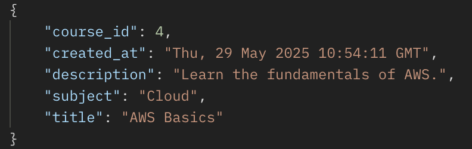

### Delete a Course (DELETE)

URL: http://127.0.0.1:5000/courses/4
Method: DELETE

Response:

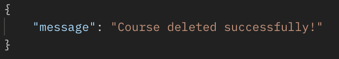

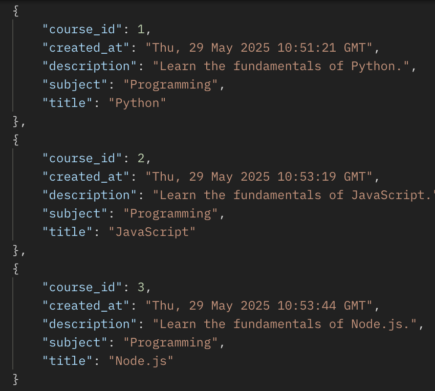

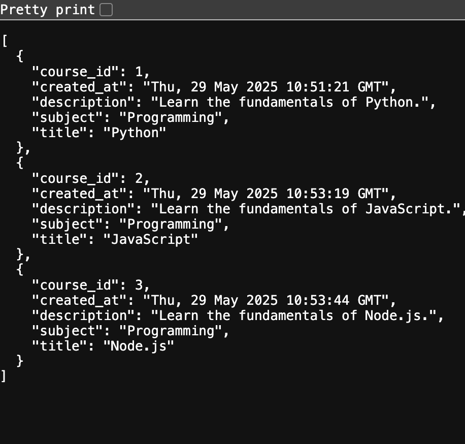

